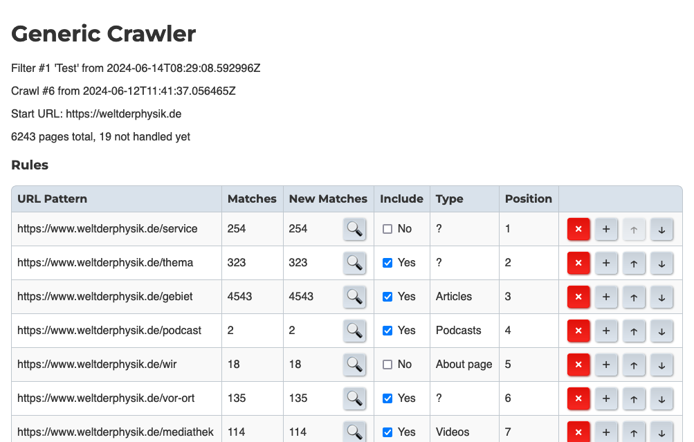
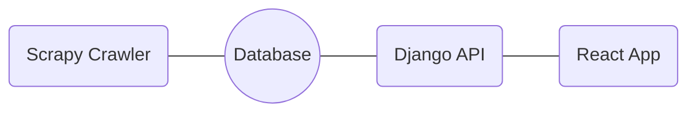
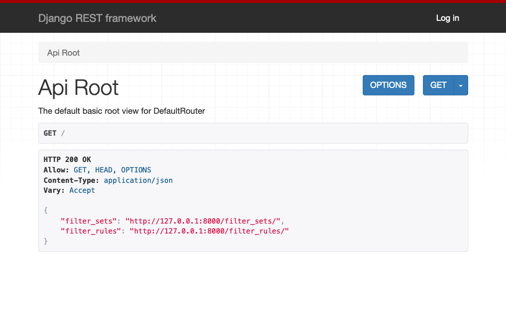
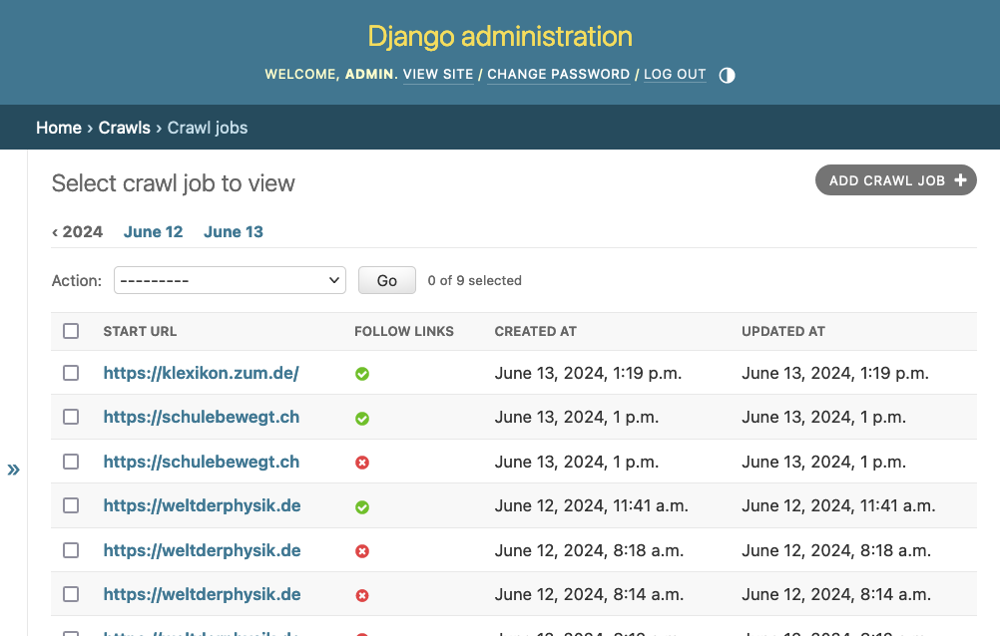

# gen-crawler-ui

Experimental frontend for the WLO generic crawler



This consists of three parts:
- A (dummy) crawler written with Scrapy which writes urls to a database
- A Django app that provides an admin view of the DB and a REST API
- A React app that provides a UI for the crawler



## Usage

First, set up a virtualenv:

```bash
python3 -m venv .venv
source .venv/bin/activate
pip install -r requirements.txt
```

Later, you only have to activate the virtualenv with `source .venv/bin/activate`.

### Running the crawler

```bash
source .venv/bin/activate
cd scraper
scrapy crawl example -a start_url=https://klexikon.zum.de/ -a follow_links=True
```

### Running the Django app

This starts the server on http://127.0.0.1:8000/

```bash
source .venv/bin/activate
cd ui
python manage.py runserver
```

The app gives an API to retrieve and edit filter sets:



It also provides an admin interface to view the crawl jobs:



### Running the React app

While the Django app is running, open a new terminal and run:

```bash
cd ui/frontend
npm install  # first run only
npm run dev
```

This starts the dev server, the URL will be printed in the terminal.
