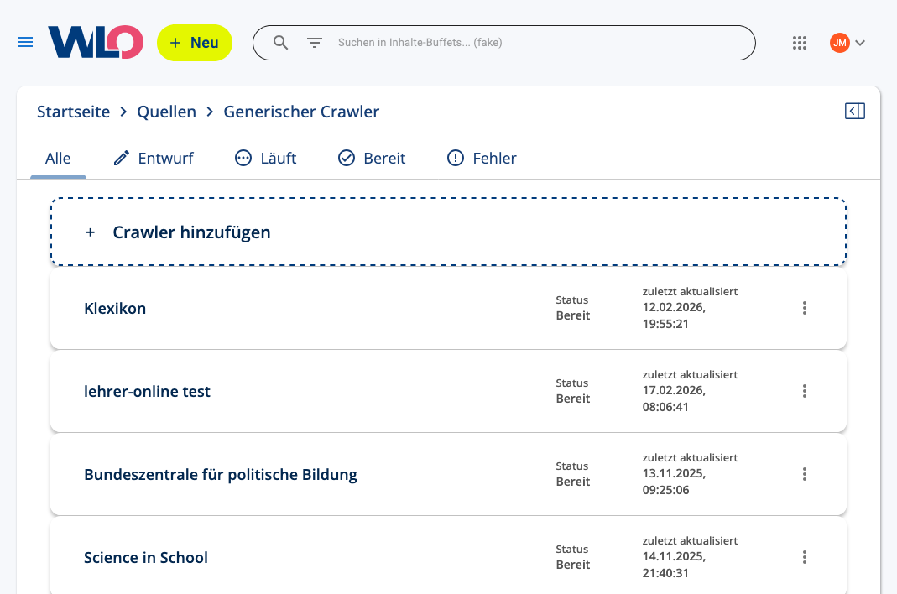
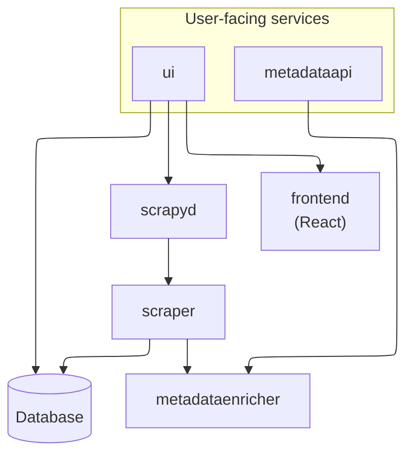
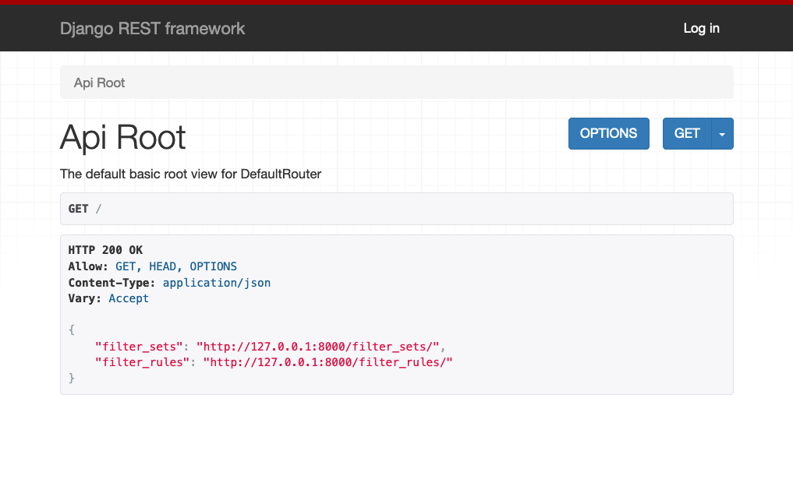
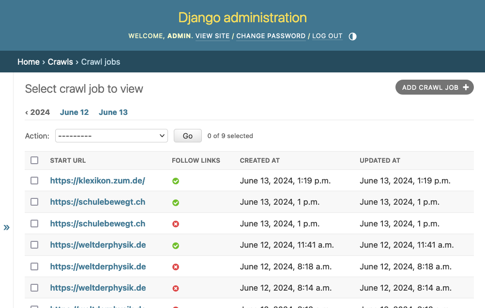

# gen-crawler-ui

Experimental frontend for the WLO generic crawler



This consists of several parts:
- 📁 frontend: Part of the frontend written in React / Typescript
- 📁 metaddataapi: A tiny server providing an API for the browser plugin
- 📁 metadataenricher: A library containing the logic to extract metadata
- 📁 scraper: Two scrapy crawlers, one to get a sitemap, and one to extract metadata
- 📁 ui: An application to control the generic crawler, based on Django




## Usage

You can use docker compose to run the application:

    docker compose up --build

You can also just run the metadata API:

    docker compose up metadataapi --build

For development, you can run in a special mode that mounts the source into the container, and watches for changes (works for the metadataapi and web apps):

    docker compose -f docker-compose.yml -f docker-compose.dev.yml up --build metadataapi

If you want to change the React code and have live reloading, you can do the following:

    DJANGO_VITE_DEV_MODE=true docker compose -f docker-compose.yml -f docker-compose.dev.yml up --build web

and in a separate window start the Vite server (`cd frontend; npm run dev`, see below).

### Manual setup

First, set up a virtualenv:

```bash
python3 -m venv .venv
source .venv/bin/activate
pip install -r requirements.txt
```

Later, you only have to activate the virtualenv with `source .venv/bin/activate`.

### Running the crawler

```bash
source .venv/bin/activate
cd scraper
scrapy crawl example -a start_url=https://klexikon.zum.de/ -a follow_links=True
```

### Running the Django app

This starts the server on http://127.0.0.1:8000/

```bash
source .venv/bin/activate
cd ui
python manage.py runserver
```

The app gives an API to retrieve and edit filter sets:



It also provides an admin interface to view the crawl jobs:



### Running the React app

While the Django app is running, open a new terminal and run:

```bash
cd ui/frontend
npm install  # first run only
npm run dev
```

This starts the dev server, the URL will be printed in the terminal.

## Production

To run in production, you can use gunicorn:

```bash
source .venv/bin/activate
cd ui
python manage.py collectstatic
DJANGO_VITE_DEV_MODE=False gunicorn crawler_ui.wsgi
```

In this mode, if you make changes to the frontend, you have to rebuild it manually:

```bash
cd frontend
npm run build
cd ../ui
python manage.py collectstatic
```
