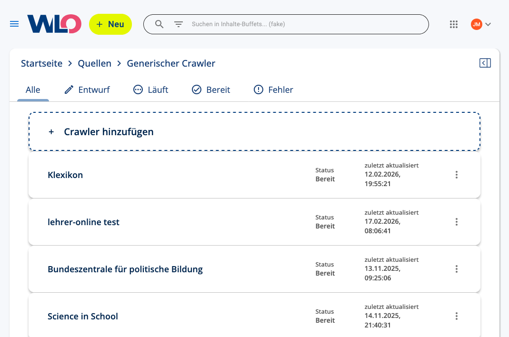
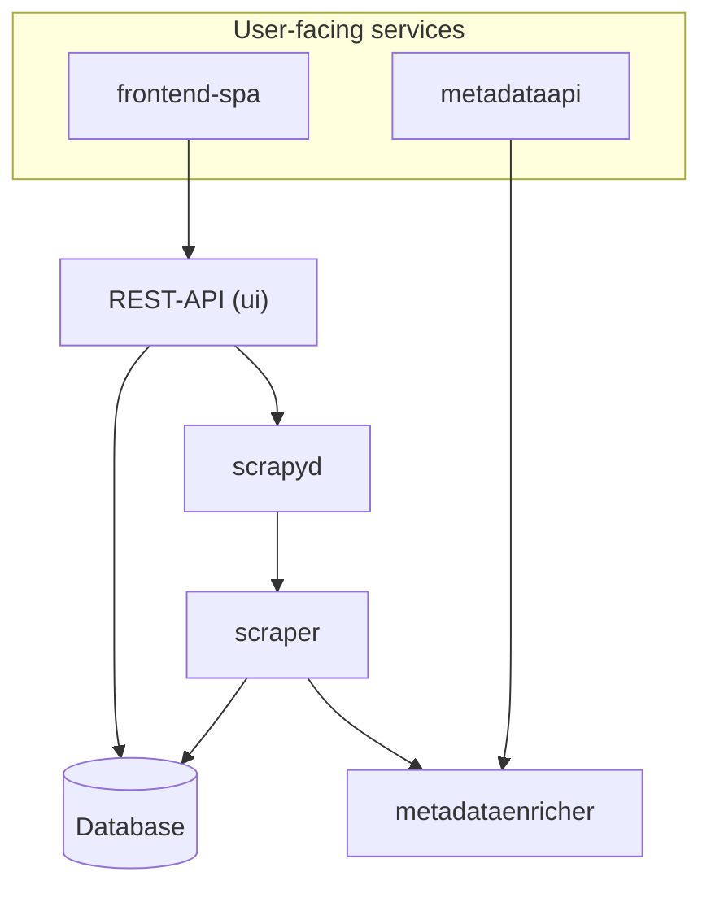
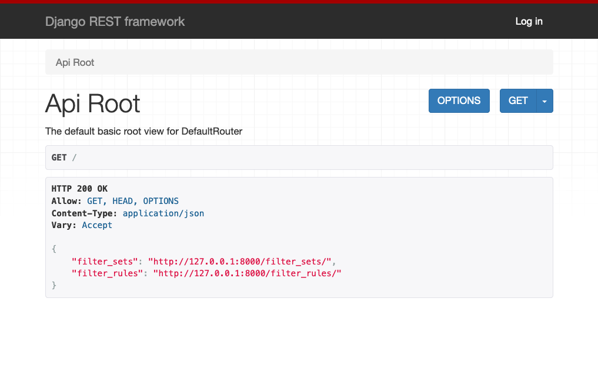
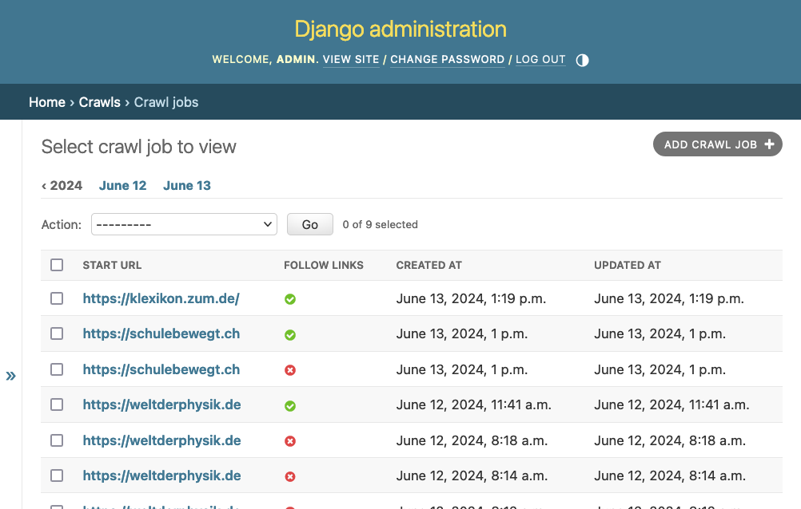

# gen-crawler-ui

Generic crawler for WLO



This consists of several parts:
- 📁 frontend-spa: Frontend written in React / Typescript
- 📁 metaddataapi: A tiny server providing an API for the browser plugin
- 📁 metadataenricher: A library containing the logic to extract metadata
- 📁 scraper: Two scrapy crawlers, one to get a sitemap, and one to extract metadata
- 📁 ui: REST API and Backend, based on Django



```mermaid
---
config:
  markdownAutoWrap: false
---
flowchart TB

subgraph "User-facing services"
    frontend-spa
    metadataapi
end
frontend-spa --> ui["REST-API (ui)"]
ui --> scrapyd
ui --> database
metadataapi --> metadataenricher
scrapyd --> scraper
scraper[scraper] --> metadataenricher
scraper --> database[(Database)]

```

## Usage

First, you need to set up certain environment variables. Make a copy of `env-template.sh` and insert your accounts and API keys (edu-sharing, Z-API, LLM, ...). Then source this file:

    source env-gwdg.sh

Recommended way to run for development, this gives you live reloading when you change something in the React code:

    DJANGO_VITE_DEV_MODE=true docker compose -f docker-compose.yml -f docker-compose.dev.yml up --build web

In a separate window start the Vite server:

    cd frontend; npm run dev

You can now access the app under http://localhost:5173.

### Alternatives

You can use docker compose to run the application:

    docker compose up --build

You can also just run the metadata API:

    docker compose up metadataapi --build

For development, you can run in a special mode that mounts the source into the container, and watches for changes. This works for the metadataapi and web apps (for web, you probably want to use React live reloading, see above):

    docker compose -f docker-compose.yml -f docker-compose.dev.yml up --build metadataapi

### Manual setup

You can also run the parts manually without docker, however this should probably not be neccessary. First, set up a virtualenv:

```bash
python3 -m venv .venv
source .venv/bin/activate
pip install -r requirements.txt
```

Later, you only have to activate the virtualenv with `source .venv/bin/activate`.

### Running the crawler

```bash
source .venv/bin/activate
cd scraper
scrapy crawl exploration -a start_url=https://klexikon.zum.de/ -a follow_links=True
```

### Running the Django app

This starts the server on http://127.0.0.1:8000/

```bash
source .venv/bin/activate
cd ui
python manage.py runserver
```

The app gives an API to retrieve and edit filter sets:



It also provides an admin interface to view the crawl jobs:



### Running the React app

While the Django app is running, open a new terminal and run:

```bash
cd frontend-spa
npm install  # first run only
npm run dev
```

This starts the dev server, the URL will be printed in the terminal.

## Production

To run in production, you can use gunicorn:

```bash
source .venv/bin/activate
cd ui
python manage.py collectstatic
DJANGO_VITE_DEV_MODE=False gunicorn crawler_ui.wsgi
```

In this mode, if you make changes to the frontend, you have to rebuild it manually:

```bash
cd frontend-spa
npm run build
cd ../ui
python manage.py collectstatic
```

## Web Component

To build the generic crawler web component:

```bash
cd frontend-spa
npx vite build --mode library
# output in dist/
```

To test the web component:

```bash
cd frontend-spa
npx vite serve
```

Now you can view it at http://localhost:5174/test_component.html .

The component can be used as follows:

```html
<script type="module" src="dist/index.js"></script>
<!-- base-path is the URL root which is used by the component for routing.
     Every URL below this is assumed to route to the component.  -->
<wlo-gen-crawler base-path="test_component.html"/>
```